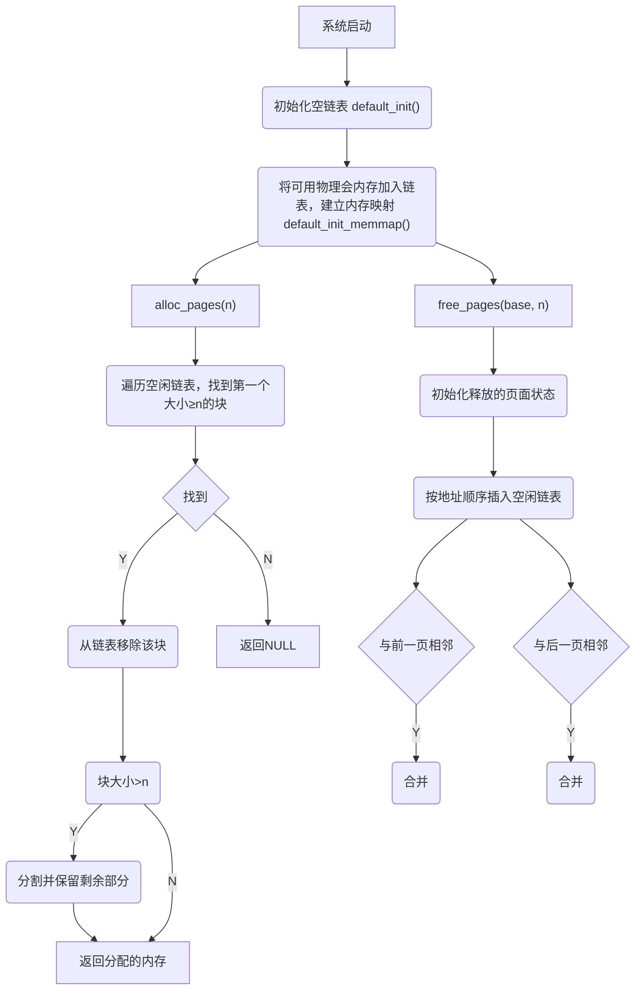
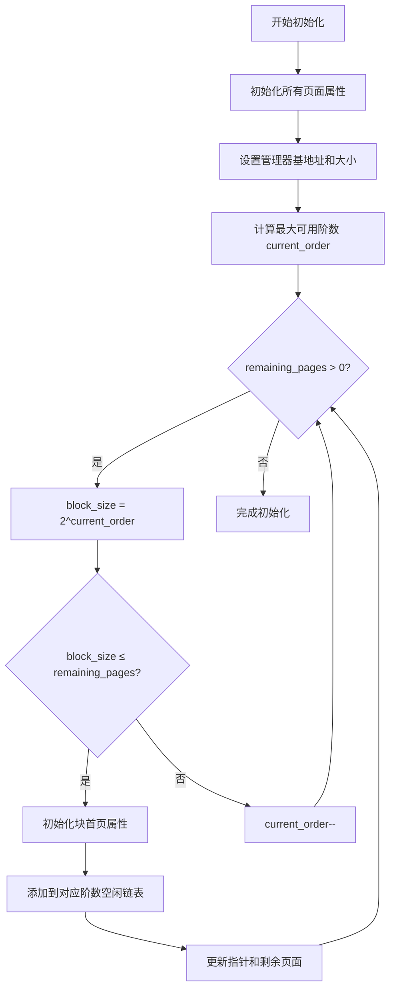
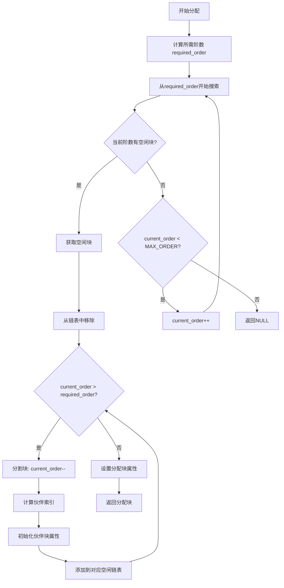
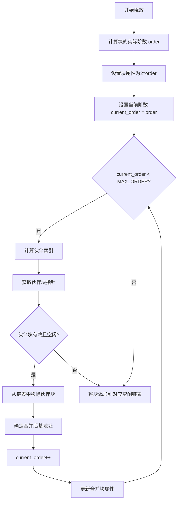

<h1 align="center" style="font-size: 50px"> 实验二：物理内存和页表 </h1>


**小组成员：**

- 管一凡：2312307
- 周雨晴：2312313
- 欧一凡：2312826

**Github仓库地址：**https://github.com/Yifan-Guan/NKU_OS_2025_lab2.git

**文件说明：**

- ./kern/mm/buddy_pmm.h为buddy system算法的头文件
- ./kern/mm/buddy_pmm.c为buddy system算法的实现文件
- ./kern/mm/slub_pmm.h为slub算法的头文件
- ./kern/mm/slub_pmm.c为slub算法的实现文件


# 理解 First-Fit 连续物理内存分配算法

## 一、函数作用分析

### 1. `default_init`

**作用**：初始化内存管理器

- 初始化空闲链表`free_list`
- 设置空闲页面计数`nr_free`为0

### 2. `default_init_memmap`

**作用**：初始化内存映射，将一段连续物理内存页加入到空闲链表中

- 遍历每个页面，清除标志位，设置引用计数为0
- 设置第一个页面的`property`字段为总页面数n
- 将第一个页面标记为有属性（PageProperty）
- 按地址顺序将内存块插入到空闲链表中（低地址在前）

### 3. `default_alloc_pages`

**作用**：分配n个连续物理页

- 遍历空闲链表，找到第一个大小≥n的内存块
- 如果找到合适的内存块： 从链表中移除该内存块 如果块大小大于n，将剩余部分重新加入链表 更新空闲页面计数
- 返回分配的内存块首地址，找不到返回NULL

### 4. `default_free_pages`

**作用**：释放n个连续物理页面

- 初始化被释放的页面状态
- 按地址顺序将内存块插入空闲链表
- 尝试与相邻内存块合并，包括与前一个块合并（前向合并） 和与后一个块合并（后向合并）

## 二、物理内存分配过程



## 三、First-fit算法改进方向

- 记录上一次分配的位置，可减少从头寻找的时间。
- 将单一的free_list分为多个链表的集合，每个子链表索引特定大小范围的页块。


# 实现 Best-Fit 连续物理内存分配算法

Best-fit算法仅在分配策略上与First-fit算法有差别，下面对差异部分进行分析：

```c
// First fit
    struct Page *page = NULL;
    list_entry_t *le = &free_list;
    while ((le = list_next(le)) != &free_list) {
        struct Page *p = le2page(le, page_link);
        if (p->property >= n) {
            page = p;
            break;
        }
    }
```

```c
// Best fit
    struct Page *page = NULL;
    list_entry_t *le = &free_list;
    size_t min_size = nr_free + 1;
    while ((le = list_next(le)) != &free_list) {
        struct Page *p = le2page(le, page_link);
        if (p->property >= n && p->property < min_size) {
            page = p;
            min_size = p->property;
        }
    }
```

First fit算法遍历链表，找到第一个大小大于或等于需求大小的页块即返回。Best fit算法遍历整个链表，返回满足大小要求的最小页块。

## Best fit 算法的改进方向

- 使用平衡二叉树代替链表，减少查表时间。
- 将不同大小的块进行分桶管理。
- 定期进行碎片清理。


# Buddy System 分配算法

## 一、伙伴系统内存分配算法设计文档

## 1. 算法概述

- **内存分割**：大块内存按需分割为更小的块
- **伙伴合并**：释放的内存块与相邻伙伴块合并为更大的块
- **多级管理**：按不同大小级别管理空闲内存块

## 2. 数据结构设计

```
#define MAX_ORDER 10        // 最大阶数，支持最大块大小为 2^10 = 1024页

static struct Page* manager_base;  // 管理的物理内存基地址
static size_t manager_n;           // 管理的物理页数量
static list_entry_t free_list[MAX_ORDER + 1];  // 按阶划分的页表
static unsigned int nr_free = 0;   // 空闲物理页数
```

## 3. 核心算法设计

 - 阶数计算函数：通过移位运算快速计算2的幂

 - 伙伴块索引计算：通过异或操作快速计算伙伴块索引

 - 有效伙伴关系验证：页索引合法且页空闲，则伙伴关系合法。

## 4. 关键操作流程

### 4.1 内存初始化 (`buddy_init_memmap`)

**输入**：基地址 `base`，页面数量 `n`

**输出**：初始化后的伙伴系统



### 4.2 内存分配 (`buddy_alloc_pages`)

**输入**：请求页面数量 `n`

**输出**：分配的内存块或NULL



### 4.3 内存释放 (`default_free_pages`)

**输入**：释放基地址 `base`，页面数量 `n`

**输出**：无



## 5. 算法特性分析

### 5.1 时间复杂度

| 操作   | 时间复杂度 | 说明                        |
| ------ | ---------- | --------------------------- |
| 分配   | O(log N)   | 最多遍历MAX_ORDER个链表     |
| 释放   | O(log N)   | 最多进行MAX_ORDER次合并尝试 |
| 初始化 | O(N)       | 需要初始化所有页面          |

### 5.2 空间效率

- **内部碎片**：最大为50%（当请求大小刚好超过2^k时）
- **外部碎片**：显著减少，通过伙伴合并机制
- **元数据开销**：每个块只需要一个property字段

### 5.3 性能优势

1. **快速分配**：通过多级链表实现常数时间查找
2. **高效合并**：通过伙伴关系实现快速合并
3. **减少碎片**：通过规整的内存块大小减少外部碎片
4. **简单实现**：算法逻辑清晰，易于理解和维护

## 6. 测试验证策略

- 基本分配释放测试
- 碎片整理测试


# 任意大小内存单元Slub分配算法

## 1.  核心特性

- **基于对象缓存**：为不同大小的对象建立专用缓存
- **SLAB管理**：使用slab作为内存分配的基本单位
- **多级缓存**：维护full、partial、free三个slab列表
- **大小分类**：支持8种标准大小的对象分配
- **回退机制**：大对象使用原始页面分配算法

## 2. 整体思路

 大对象： First-Fit分配器

 小对象 ：SLUB分配器  —-> SLAB分配

## 3. 数据结构设计

### 3.1 缓存描述符 (kmem_cache_t)

```
typedef struct kmem_cache {
    char name[16];              // 缓存名称（调试用）
    size_t objsize;            // 用户请求的对象大小
    size_t size;               // 实际分配大小（包含元数据）
    unsigned int num;          // 每个slab中的对象数量
    struct slab *slabs_full;   // 完全使用的slab列表
    struct slab *slabs_partial;// 部分使用的slab列表  
    struct slab *slabs_free;   // 完全空闲的slab列表
    int offset;                // 空闲指针偏移量
} kmem_cache_t;
```

**字段说明**：

- `objsize`vs `size`：`size = objsize + sizeof(void*)`，额外空间用于维护空闲链表
- `num`：根据页面大小和对象大小动态计算：`(PGSIZE - sizeof(slab_t)) / size`
- 三个slab列表采用不同的管理策略，提高分配效率

### 3.2 SLAB描述符 (slab_t)

```
typedef struct slab {
    struct slab *next;         // 下一个slab（链表指针）
    void *freelist;            // 空闲对象链表头指针
    int inuse;                 // 已使用对象数量
    int free;                  // 空闲对象数量
    void *base;                // slab内存基地址
    kmem_cache_t *cache;       // 所属缓存指针
} slab_t;
```

**内存布局**：

```
┌─────────────────────┐ ← slab->base
│    slab_t元数据      │
│   (slab描述符)       │
├─────────────────────┤ ← slab->freelist
│     对象0           │
├─────────────────────┤
│     对象1           │
├─────────────────────┤
│        ...          │
├─────────────────────┤
│   对象[num-1]       │
└─────────────────────┘
```

### 3.3 空闲对象链表结构

每个空闲对象的前sizeof(void*)字节用作链表指针：

```
对象内存布局：
┌─────────────────────┐
│   next指针           │ ← 空闲时用作链表指针
├─────────────────────┤
│   用户数据区域        │ ← 分配后返回给用户的地址
└─────────────────────┘
```

## 4. 算法详细设计

- SLUB系统初始化：初始化全局空闲列表
- 内存映射初始化：与原有算法兼容，维护页面级别的空闲列表。
- 分配主流程：大对象使用原始页面分配，小对象使用SLUB分配
- SLUB核心分配算法：优先从partial slab分配，再从free slab分配 ，最后创建新slab
-  释放主流程：大对象使用原始页面释放，小对象使用SLUB释放
- SLUB核心释放算法：查找对象所属的slab，将对象放回空闲链表，调整slab状态
- 创建新SLAB：分配一个物理页面，初始化slab结构，构建空闲对象链表

## 5. 性能优化策略

### 5.1 分配路径优化

1. **快速路径**：优先从partial slab分配，命中率高
2. **慢速路径**：partial slab不足时从free slab分配
3. **最慢路径**：需要创建新slab

### 5.2 释放路径优化

1. **快速合并**：释放对象直接加入空闲链表
2. **惰性释放**：不完全空闲的slab保持在内存中
3. **内存回收**：可在系统内存紧张时释放完全空闲的slab

## 6. 测试与验证

1. **边界情况**：0字节分配、极大对象分配
4. **性能对比**：与原有算法性能比较


# 硬件的可用物理内存范围的获取方法

## 1、设备树（Device Tree）解析

RISC-V 启动时（如通过 OpenSBI）通常会传递设备树（DTB）给内核，其中包含 `/memory`节点的 `reg`属性，明确标注可用物理内存范围。

## 2、ACPI 表（高级配置与电源接口）

支持 ACPI 的系统（如某些 RISC-V 服务器）通过 `SRAT`（系统资源关联表）或 `NFIT`（NVDIMM 固件接口表）描述内存。

## 3、类BIOS/UEFI 调用

部分 RISC-V 平台会模拟 x86 BIOS 接口（如 EDK2/UEFI）。

## 4、渐进式内存探测

从已知起始地址开始**（如 RISC-V 通常的 `0x80000000`）。 **逐页测试**：尝试读写物理页，成功则标记为可用。 **处理空洞：跳过不可访问区域（如 MMIO 或保留内存）。

## 5、SBI 调用（RISC-V 特权层）

通过 SBI（Supervisor Binary Interface）查询平台信息。


# 相关知识点

## 一、实验中重要的知识点及对应的OS原理

### 1. 连续物理内存分配算法

**实验知识点**：First-Fit、Best-Fit算法实现
**对应原理**：动态分区存储管理

- **含义**：管理可变大小的内存分区，满足不同大小的内存请求
- **关系**：实验实现了原理中的具体算法，通过链表管理空闲内存块
- **差异**：原理关注理论模型，实验关注具体实现细节（如链表操作、合并策略）

### 2. 伙伴系统（Buddy System）

**实验知识点**：按2的幂次方分割和合并内存块
**对应原理**：固定分区与动态分区的折中方案

- **含义**：通过伙伴关系实现高效的内存分配和碎片整理
- **关系**：实验完整实现了伙伴系统的分割、分配、合并机制
- **差异**：实验增加了具体的阶数计算、伙伴索引计算等实现细节

### 3. SLUB分配器

**实验知识点**：基于对象缓存的细粒度内存管理
**对应原理**：Slab分配器

- **含义**：为内核对象提供高效的内存分配，减少内部碎片
- **关系**：SLUB是Slab的改进版本，实验实现了其核心思想
- **差异**：实验简化了实际SLUB的复杂优化

### 4. 内存碎片问题

**实验知识点**：外部碎片、内部碎片的表现和处理
**对应原理**：内存碎片化理论

- **含义**：分析不同算法产生的碎片类型和影响
- **关系**：实验通过具体算法展示了碎片产生和减少的过程
- **差异**：原理侧重分析，实验通过实际数据验证

### 5. 物理内存探测

**实验知识点**：设备树解析、ACPI表、渐进式探测
**对应原理**：硬件资源发现机制

- **含义**：操作系统如何获取可用的物理内存信息
- **关系**：实验涉及了多种探测方法，原理关注通用机制
- **差异**：实验针对RISC-V架构，原理覆盖多种体系结构

## 二、OS原理重要但实验未涉及的知识点

### 1. 虚拟内存管理

- **页表机制**：多级页表、TLB管理
- **地址转换**：虚拟地址到物理地址的转换过程
- **缺页异常**：页面错误处理机制

### 2. 页面置换算法

- **OPT、LRU、FIFO、Clock**等页面置换策略
- **工作集模型**：局部性原理的应用
- **Belady异常**：FIFO算法的特殊现象

### 3. 内存保护机制

- **读写执行权限**：页表项中的保护位
- **地址空间隔离**：进程间内存保护
- **Copy-on-Write**：写时复制技术

### 4. 内存映射文件

- **mmap机制**：文件到内存的映射
- **按需调页**：延迟加载策略
- **共享内存**：进程间通信机制

