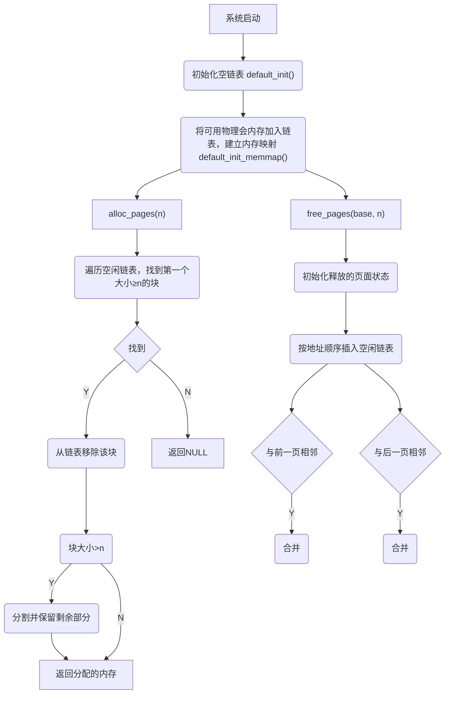
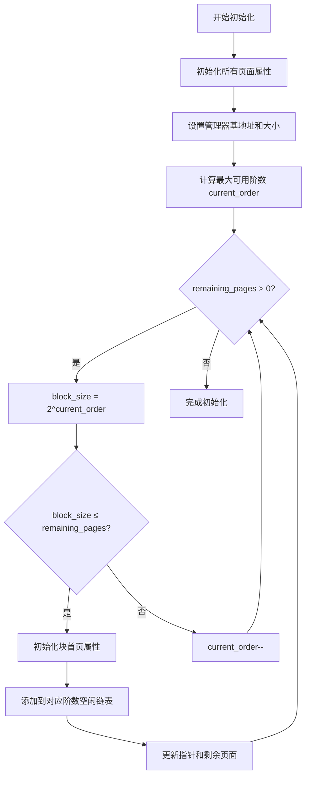
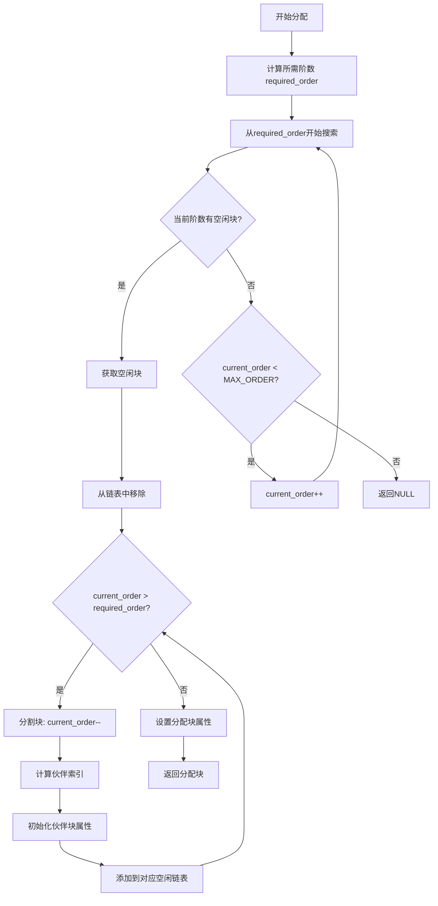
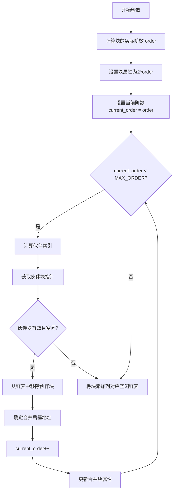

<h1 align="center" style="font-size: 50px"> 实验二：物理内存和页表 </h1>


# 理解 First-Fit 连续物理内存分配算法

## 一、函数作用分析

### 1. `default_init`

**作用**：初始化内存管理器

- 初始化空闲链表`free_list`
- 设置空闲页面计数`nr_free`为0

### 2. `default_init_memmap`

**作用**：初始化内存映射，将一段连续物理内存页加入到空闲链表中

- 遍历每个页面，清除标志位，设置引用计数为0
- 设置第一个页面的`property`字段为总页面数n
- 将第一个页面标记为有属性（PageProperty）
- 按地址顺序将内存块插入到空闲链表中（低地址在前）

### 3. `default_alloc_pages`

**作用**：分配n个连续物理页

- 遍历空闲链表，找到第一个大小≥n的内存块
- 如果找到合适的内存块： 从链表中移除该内存块 如果块大小大于n，将剩余部分重新加入链表 更新空闲页面计数
- 返回分配的内存块首地址，找不到返回NULL

### 4. `default_free_pages`

**作用**：释放n个连续物理页面

- 初始化被释放的页面状态
- 按地址顺序将内存块插入空闲链表
- 尝试与相邻内存块合并，包括与前一个块合并（前向合并） 和与后一个块合并（后向合并）

## 二、物理内存分配过程



## 三、First-fit算法改进方向

- 记录上一次分配的位置，可减少从头寻找的时间。
- 将单一的free_list分为多个链表的集合，每个子链表索引特定大小范围的页块。

# 实现 Best-Fit 连续物理内存分配算法

Best-fit算法仅在分配策略上与First-fit算法有差别，下面对差异部分进行分析：

```c
// First fit
    struct Page *page = NULL;
    list_entry_t *le = &free_list;
    while ((le = list_next(le)) != &free_list) {
        struct Page *p = le2page(le, page_link);
        if (p->property >= n) {
            page = p;
            break;
        }
    }
```

```c
// Best fit
    struct Page *page = NULL;
    list_entry_t *le = &free_list;
    size_t min_size = nr_free + 1;
    while ((le = list_next(le)) != &free_list) {
        struct Page *p = le2page(le, page_link);
        if (p->property >= n && p->property < min_size) {
            page = p;
            min_size = p->property;
        }
    }
```

First fit算法遍历链表，找到第一个大小大于或等于需求大小的页块即返回。Best fit算法遍历整个链表，返回满足大小要求的最小页块。

## Best fit 算法的改进方向

- 使用平衡二叉树代替链表，减少查表时间。
- 将不同大小的块进行分桶管理。
- 定期进行碎片清理。

# Buddy System 分配算法

# 伙伴系统内存分配算法设计文档

## 1. 算法概述

- **内存分割**：大块内存按需分割为更小的块
- **伙伴合并**：释放的内存块与相邻伙伴块合并为更大的块
- **多级管理**：按不同大小级别管理空闲内存块

## 2. 数据结构设计

```
#define MAX_ORDER 10        // 最大阶数，支持最大块大小为 2^10 = 1024页

static struct Page* manager_base;  // 管理的物理内存基地址
static size_t manager_n;           // 管理的物理页数量
static list_entry_t free_list[MAX_ORDER + 1];  // 按阶划分的页表
static unsigned int nr_free = 0;   // 空闲物理页数
```

## 3. 核心算法设计

 - 阶数计算函数：通过移位运算快速计算2的幂

 - 伙伴块索引计算：通过异或操作快速计算伙伴块索引

 - 有效伙伴关系验证：页索引合法且页空闲，则伙伴关系合法。

## 4. 关键操作流程

### 4.1 内存初始化 (`buddy_init_memmap`)

**输入**：基地址 `base`，页面数量 `n`

**输出**：初始化后的伙伴系统



### 4.2 内存分配 (`buddy_alloc_pages`)

**输入**：请求页面数量 `n`

**输出**：分配的内存块或NULL



### 4.3 内存释放 (`default_free_pages`)

**输入**：释放基地址 `base`，页面数量 `n`

**输出**：无



## 5. 算法特性分析

### 5.1 时间复杂度

| 操作   | 时间复杂度 | 说明                        |
| ------ | ---------- | --------------------------- |
| 分配   | O(log N)   | 最多遍历MAX_ORDER个链表     |
| 释放   | O(log N)   | 最多进行MAX_ORDER次合并尝试 |
| 初始化 | O(N)       | 需要初始化所有页面          |

### 5.2 空间效率

- **内部碎片**：最大为50%（当请求大小刚好超过2^k时）
- **外部碎片**：显著减少，通过伙伴合并机制
- **元数据开销**：每个块只需要一个property字段

### 5.3 性能优势

1. **快速分配**：通过多级链表实现常数时间查找
2. **高效合并**：通过伙伴关系实现快速合并
3. **减少碎片**：通过规整的内存块大小减少外部碎片
4. **简单实现**：算法逻辑清晰，易于理解和维护

## 6. 测试验证策略

- 基本分配释放测试
- 碎片整理测试

# 任意大小内存单元Slub分配算法

# 硬件的可用物理内存范围的获取方法

